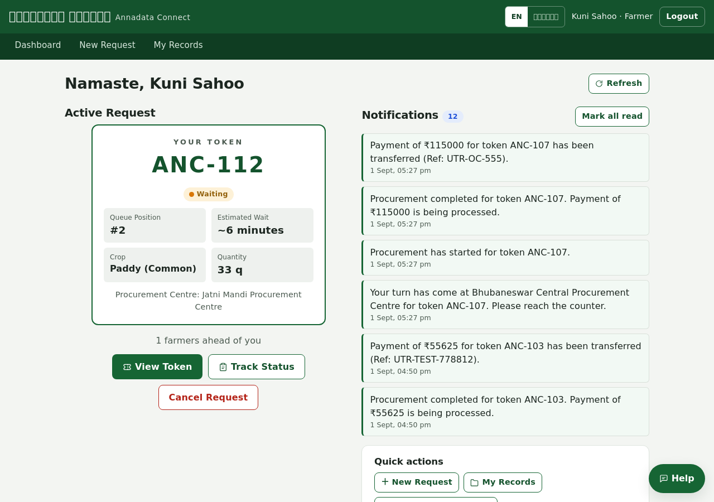
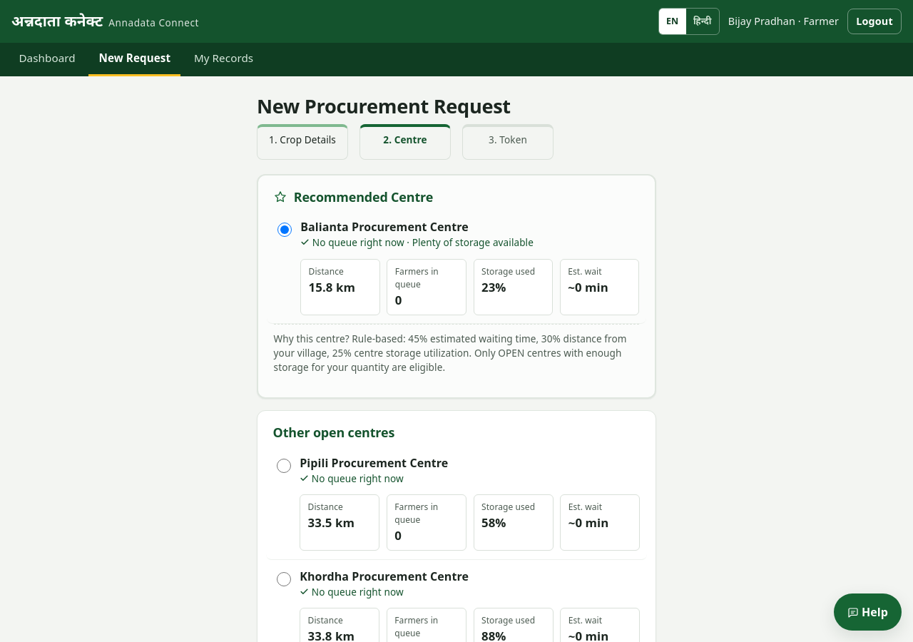
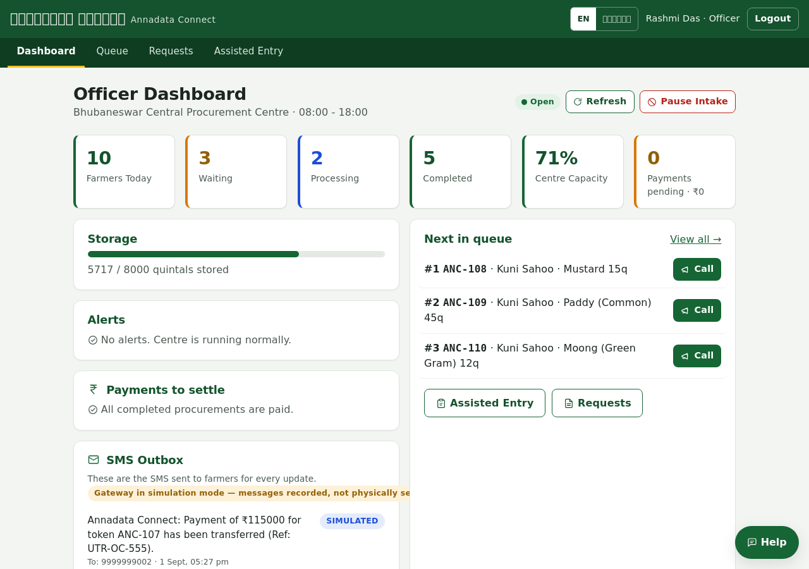
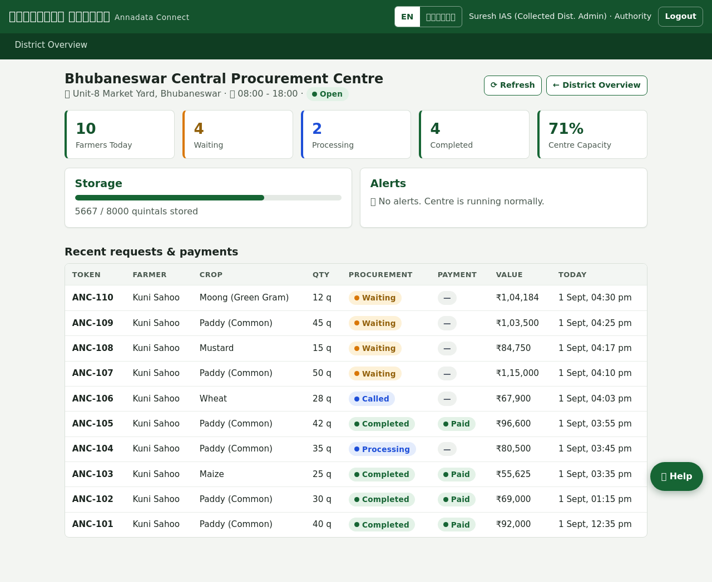
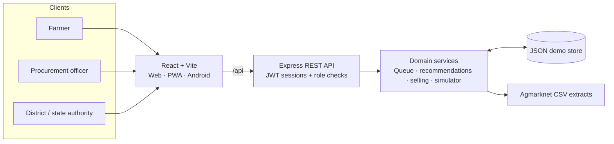

<div align="center">
  
  <h1>Annadata Connect</h1>
  <p><strong>Make crop procurement clearer — from the first booking to the final payment.</strong></p>
  <p>अन्नदाता कनेक्ट · ଅନ୍ନଦାତା କନେକ୍ଟ<br />A farmer-first procurement platform for an Odisha pilot scenario</p>
  <p>
    
    
    
    
    
  </p>
  <p>
    <a href="#product-features">Explore features</a> ·
    <a href="#quick-start">Run locally</a> ·
    <a href="#try-the-demo">Try the demo</a> ·
    <a href="DELIVERABLES.md">Implementation details</a>
  </p>
</div>

> **Hackathon prototype — not a live government service.** Sign-in is mocked, OTP codes are displayed in the app, and operational records, centre capacity, buyer offers and MSP examples are seeded demo values. Do not use this build for real identities, payments or procurement decisions. Historical mandi-price records are sourced separately and their coverage and caveats are documented below.

## The idea

Farmers should be able to understand their options before travelling to a procurement centre. Annadata Connect brings the core journey into one mobile-first experience: compare eligible centres, book a token, follow queue progress, and see procurement and payment status. Centre staff work from the same shared system, while administrators get a view of demand and capacity across districts.

The project is designed as a **complete, explorable hackathon MVP**: a React web app, a role-aware Express API, a seeded local dataset, an installable PWA, and a Capacitor-based Android app experience.

## Product preview

These captures show the interface and seeded demo state. The portal's headline statistics and all operational figures shown in screenshots are illustrative, not live service metrics.

<table>
  <tr>
    <td width="50%" align="center">
      <a href="screenshots/polish-farmer.png"></a><br />
      <strong>Farmer dashboard</strong>
    </td>
    <td width="50%" align="center">
      <a href="screenshots/polish-reco.png"></a><br />
      <strong>Explainable centre recommendation</strong>
    </td>
  </tr>
  <tr>
    <td width="50%" align="center">
      <a href="screenshots/polish-officer.png"></a><br />
      <strong>Centre operations</strong>
    </td>
    <td width="50%" align="center">
      <a href="screenshots/authority-centre-detail.png"></a><br />
      <strong>Authority drill-down</strong>
    </td>
  </tr>
</table>

## Product features

| Experience | What it enables |
| --- | --- |
| **Farmer** | Register with the demo flow; request procurement; compare nearby eligible centres; receive a token; follow queue and status updates; review records, payment status and a QR-enabled farmer ID card. |
| **Smart Sell** | Compare government MSP-centre options with seeded market-buyer offers before booking. Options show price, estimated value and transport assumptions; offers are illustrative, not live quotes. |
| **Mandi intelligence** | Explore historical prices by mandi, district or state, compare markets, inspect monthly trends and seasonality, and download source rows as CSV. |
| **Procurement officer** | Manage a centre's intake, queue and request lifecycle; call, start, complete or reject requests; record payment status; and assist walk-in farmers. |
| **District & state authority** | Monitor demand, queue congestion, centre capacity and procurement trends; inspect centre details; run a what-if simulator that does not modify stored operations. |
| **Accessible field experience** | Responsive, mobile-first UI in English, हिन्दी and ଓଡ଼ିଆ; installable PWA; Android experience built from the shared frontend with Capacitor. |
| **Farmer assistant** | Rule-based help for a small set of approved topics. It is intentionally not an LLM and falls back for unsupported questions. |

Centre recommendations use a documented rule-based score: **45% estimated wait, 30% straight-line distance, and 25% storage utilization**. Only open centres with enough remaining capacity are eligible. The UI exposes the inputs so a farmer can see why a centre was suggested.

## How the pieces fit



For a single-process deployment, Express serves both the API and the built frontend from one port. During development, Vite serves the UI and proxies `/api` to the backend.

### Technology

| Layer | Implementation |
| --- | --- |
| Web | React 18.3, Vite 5, React Router 6, custom responsive design system and translation dictionaries |
| API | Node.js 22+, Express 4, JWT sessions, bcrypt password hashing and role guards |
| Demo persistence | File-backed JSON store in `backend/data/db.json`; no external database required locally |
| Mobile | Installable web app plus Capacitor-based Android project |
| Tests | Node test runner + Supertest, Playwright browser tests, and an i18n parity check |

## Quick start

### Requirements

- **Node.js 22 or newer** and npm
- No separate database is needed for the local demo. On first boot, the backend creates and seeds `backend/data/db.json`.

### Run the web app with hot reload

```bash
git clone https://github.com/ssambit635-svg/ssambit635-svg-Annadata-Connect.git
cd ssambit635-svg-Annadata-Connect
npm run setup
cp backend/.env.example backend/.env   # optional for local defaults; ignored by Git
```

Start the API and frontend in separate terminals:

```bash
# Terminal 1 — Express API at http://localhost:5000
npm run dev:backend
```

```bash
# Terminal 2 — Vite app at http://localhost:5173 (proxies /api to :5000)
npm run dev:frontend
```

Open **<http://localhost:5173>**. The Vite proxy target can be changed with `API_PROXY_TARGET` in `frontend/.env`; browser code still uses same-origin `/api` calls.

### Run as a single process

To build the frontend and have Express serve the UI and API together:

```bash
npm run build
npm start
```

Then open **<http://localhost:5000>**. Check the API with `curl http://localhost:5000/api/health`.

### Configuration

The defaults are suitable for local development. Set production values in the backend environment, and never put server secrets in frontend `VITE_*` variables.

| Variable | Default | Purpose |
| --- | --- | --- |
| `PORT` | `5000` | Express listen port |
| `JWT_SECRET` | Development fallback | Set a unique secret of at least 32 characters in production |
| `SEED_ON_BOOT` | `true` | Create the demo dataset if the JSON store is missing |
| `CORS_ORIGIN` | Empty | Restrict allowed origins when the frontend is hosted separately |
| `VITE_API_BASE_URL` | Empty / same-origin | Optional public API origin for a separately hosted frontend |
| `API_PROXY_TARGET` | `http://127.0.0.1:5000` | Vite's server-side `/api` proxy target; never used directly by a remote browser |
| `SMS_PROVIDER` | `sim` | Procurement notification mode; does not deliver authentication codes |

See [`backend/.env.example`](backend/.env.example), [`frontend/.env.example`](frontend/.env.example), [AUTH_SETUP.md](AUTH_SETUP.md) and [DEPLOYMENT.md](DEPLOYMENT.md) for the full configuration and hardening guidance.

## Try the demo

The default local seed covers six Odisha districts and 14 sample procurement centres. These are demonstration records, not connected to government systems. Sign in with the **Password** option or use the on-screen demo-account picker.

| Role | Phone | Password | Demo scope |
| --- | --- | --- | --- |
| Farmer | `9999999001` | `Farmer@123` | Create and track a procurement request |
| Procurement officer | `9999999101` | `Officer@123` | Manage the Bhubaneswar Central centre queue |
| District authority | `9999999201` | `Authority@123` | View district-level operations |
| State authority | `9999999202` | `Authority@123` | Open the Odisha state monitor |

A simple end-to-end walkthrough:

1. Sign in as the farmer and create a request for a crop and quantity.
2. Review the recommended centre and its distance, queue, storage and estimated wait; confirm to receive a token.
3. Sign in as the officer and advance the request through the queue. The farmer's status and notifications update from the shared backend state.
4. Sign in as an authority to review centre capacity and district/state activity.

Mock SMS and email codes are generated locally and displayed on screen. No authentication message is sent to a phone or email address. More on mock accounts and limits: [AUTH_SETUP.md](AUTH_SETUP.md).

## Data, assumptions & trust

### Historical market prices

Mandi-price screens use **7,208 monthly observations** for paddy, wheat, maize, mustard and cotton (2021–2025), at mandi, district and state levels. The extracts are curated from Agmarknet 2.0 data via [the upstream research repository](https://github.com/pointbreak71/dpi410-final-project-v2); they are committed under `backend/src/data/agmarknet/` and load locally without a network request.

A data caveat matters: the upstream repository publishes mandi-level min/max price bands but not its modal-price panel, so this project's mandi `modal_price_avg` is the midpoint of those published min/max averages. District/state means are upstream aggregates. Coverage is a selected extract, not a complete national market feed, and the charts are descriptive — **not forecasts**. See [HISTORICAL_DATA.md](HISTORICAL_DATA.md) for provenance, fields, selection rules and validation notes.

### Demo boundaries

- Authentication is fully mocked: no Google OAuth, real SMS verification, or email delivery is configured. Mock OTPs are visible in the UI.
- The JSON store is single-process demo storage. Use a transactional database and shared verification/rate-limit storage before scaling.
- Seeded MSP figures, centre conditions, market-buyer rates and operational history are illustrative. Smart Sell comparisons are not offers or guarantees of procurement.
- Wait times are estimates; distances are straight-line, not road routes. Simulator outputs are planning scenarios, not predictions.
- API authorization and role checks are implemented, but **this build is not ready for real users or real personal/financial data**. Production hardening guidance is in [DEPLOYMENT.md](DEPLOYMENT.md).

## Tests & quality checks

```bash
npm test                                  # backend unit/contract tests
npm run build                             # production frontend build
npm --prefix frontend run test:i18n       # translation key parity
```

Browser tests use Playwright. Install Chromium once, then run:

```bash
cd frontend
npx playwright install chromium
npm run test:e2e
```

## Deployment & mobile

- **Single service:** build the frontend, then run the Express backend; it serves both UI and API.
- **Render:** a starter blueprint is provided in `render.yaml`. Free-tier sleep and ephemeral storage make it suitable for a demo, not a durable production service.
- **Static frontend:** `netlify.toml` configures Netlify; set `VITE_API_BASE_URL` to the public HTTPS API origin when hosting the UI separately.
- **PWA / Android:** install the web app as a PWA or build the Capacitor Android app. The APK workflow is in [`.github/workflows/android-apk.yml`](.github/workflows/android-apk.yml).

See [FREE_STACK.md](FREE_STACK.md) for the demo deployment and APK flow, [SAATHI_APP.md](SAATHI_APP.md) for the Android frontend, and [DEPLOYMENT.md](DEPLOYMENT.md) for deployment and hardening details.

## Project map

```text
backend/                 Express API, services, JSON store, seeded data and tests
frontend/                React + Vite web app, PWA assets and Capacitor Android project
scripts/                 Agmarknet extract builders and translation checks
screenshots/             Product captures used in this README
API_INTEGRATION_MAP.md   API endpoints, roles and payload contract
AUTH_SETUP.md            Mock authentication, demo accounts and constraints
HISTORICAL_DATA.md       Market-data provenance, caveats and pipeline
DELIVERABLES.md          Feature coverage and known limitations
TECH_STACK.md            Detailed technology inventory
DEPLOYMENT.md             Deployment and production hardening
FREE_STACK.md             Free/demo hosting and APK instructions
SAATHI_APP.md             Android app design and build guide
```

For API details, see [API_INTEGRATION_MAP.md](API_INTEGRATION_MAP.md). For the full feature inventory and known limitations, see [DELIVERABLES.md](DELIVERABLES.md).
